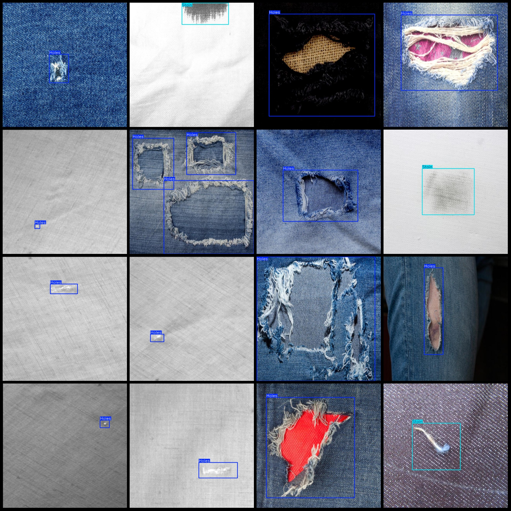

# Cloth Defects and Dimples Detection Dataset: VOC+YOLO Format with 1690 Images in 2 Categories

Dataset Format: Pascal VOC format + YOLO format (txt files without split paths, only contain jpg images and corresponding VOC format xml files and yolo format txt files)
Number of Images (jpg file count): 1690
Number of Annotations (xml file count): 1690
Number of Annotations (txt file count): 1690
Number of Annotation Categories: 2
Repository: firc-dataset
Annotation Category Names (Note that the order of categories in the yolo format does not correspond to this, but is based on the labels folder's classes.txt): ["Holes", "Stain"]
Number of Boxes per Category:
Holes (Dimples) Boxes = 1268
Stain (Dust Marks) Boxes = 1196
Total Boxes: 2464
Image Resolution: 640x640
Dataset Enhancement: Yes, approximately 500 images are original and the rest are enhanced images.
Annotation Tool: labelImg
Annotation Rules: Draw boxes around the categories
Important Notes: None
Special Statement: This dataset does not guarantee the accuracy of the trained models or weight files.
Image Preview:

## Images

Here is a pay link on Stripe ( https://buy.stripe.com/3cs8yP7sY87d0vu9AB ). Please contact me lonlonago@foxmail.com after funding $89, and I will send you a complete data files , thank you!

